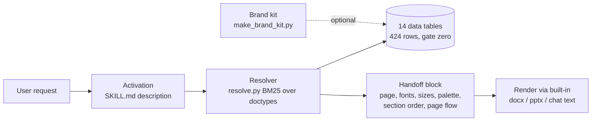
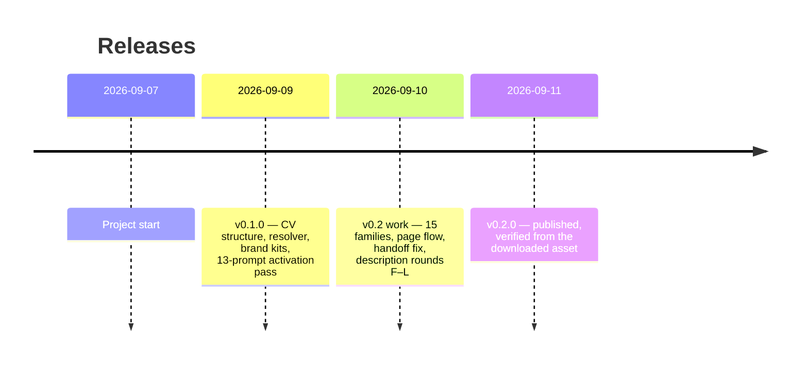

# Project map — Document Design Intelligence

One page: what the skill is made of, what each part does today, and what is
still open. Written 2026-09-11 after v0.2.0 shipped. Detail and rulings live in
RESUME.md; this is the picture.

## 1. What the skill is

A Claude skill that does for documents (CVs, letters, invoices, reports, decks,
brochures…) what UI/UX Pro Max does for screens: it carries a library of layout,
typography, colour, print, ATS and structure rules, picks the right ones for the
request, and hands concrete values to the built-in docx/pptx skills to render.

## 2. Status by layer

| Layer | What it does | v0.1.0 | v0.2.0 | Open |
|---|---|---|---|---|
| Data library | 14 CSV tables loaded only by `load-base.py`, validated by `validate_data.py` | 291 rows, gate zero | 424 rows, gate zero | heading variants for non-CV families; characterSpacing column missing |
| Section models | which sections a document has, in which order, headings in EN/FR/DE | CVs only (2 of 17) | all 17 structures (52 sections, 204 headings) | infographic has no structure by design; 3 pairs share an order on purpose |
| Page flow | keep-with-next, widows/orphans, table split, header repeat | absent | 5 rules, reach the docx handoff | convention-tagged, not sourced |
| Type scales | sizes and leading per role | report/CV had body only | h1–h3 for reports, h1–h2 for CVs | convention-tagged |
| Resolver | picks doctype from the request, abstains when unsure | works; D3 over-confident | unchanged + honest "no guidance" only when truly empty | D3 tie (BM25 length), no language weight in ranking |
| Handoff block | the values the renderer actually uses | **empty** except nothing (undetected) | full: page, margins, fonts, sizes, palette, headings, page flow | characterSpacing reads a nonexistent column |
| Plain-text output | structure when the user wants chat text | dropped the section model | keeps section order and headings (proven in test) | — |
| Activation | whether Claude chooses the skill at all | 13/13 activation prompts pass | same 13 pass; nouns for 15 families added; priority sentence first | EN/FR letters, memos, reports often routed to docx or chat; workaround "Use the document-design-intelligence skill." |
| Brand kits | user brand → private tables, never shipped | works, privacy tested | unchanged | 2 single-word keyword duplication sites ungated |
| Tests / gates | prove output says something, not just that rows are valid | 133 tests | 159 tests + 32 subtests; coverage, mirror, handoff, generator round-trip | — |
| Release | tag → CI builds ZIP, writes VERSION, publishes notes | worked by accident (one section) | publishes only the tagged section, fails loudly if missing | — |

## 3. Timeline

## 4. What we learned (the rules that now govern the work)

- A green data gate proves rows are well-formed; only an end-to-end test proves
  the output says something. The handoff block shipped empty for two releases
  because every check asked "did it run", not "did it print anything".
- Activation failures were never about nouns. Claude's own account showed it
  grabbed docx and never opened the skill; five description changes did not
  move EN/FR prose genres. Naming the skill in the request does.
- Test prompts must carry their content inline or as an attachment, and must
  not pre-supply the structure under test.
- If a file has a generator, edit the generator (schema-manifest.json,
  rationale/*.md).
- Refuse unverifiable attribution: if a source cannot be grep-verified in the
  library, tag the row CONVENTION.

## 5. What is next (v0.3 candidates, none started)

Ordered by user value:

1. **Routing for EN/FR prose genres.** Blocked on a new mechanism hypothesis
   backed by Claude's own account; do not try more description wording.
2. **Language signal in ranking** (cv-france on "fais-moi un cv") and the
   **D3 tie** (BM25 length normalisation). Need real query data first.
3. **Heading variants** for the 15 non-CV families (2–3 wordings per language,
   as CVs already have).
4. **Panel and slide layout order** — a real model gap; section order carries
   the content arc only.
5. **characterSpacing**: remove the handoff section or author the column.
6. Small: manifest NOTES §1.4 wording; two make_brand_kit duplication sites;
   acceptance set rebalanced so each family is tested in two languages.

## 6. Where things are

- Repo: https://github.com/Magazem/Smart-design (root = project root)
- Releases: https://github.com/Magazem/Smart-design/releases
- State file: `RESUME.md` (read first in any new session)
- Acceptance sets: `skill/document-design-intelligence/references/activation.md`
  (13 prompts) and `research/44-v02-acceptance.md` (15 prompts)
- Description candidates and their refutations: `research/38-description-candidate.md`
